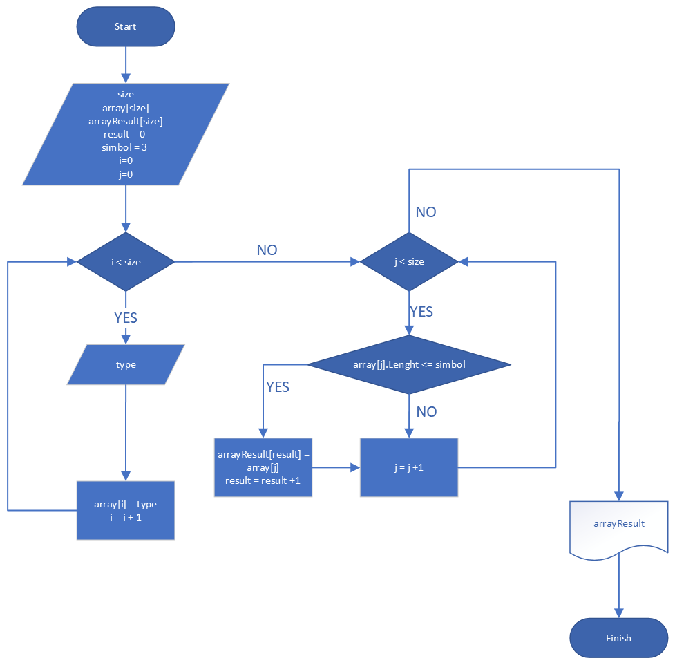

*Задача*: 
Написать программу, которая из имеющегося массива строк формирует массив из строк, длина которых меньше либо равна 3 символам. Первоначальный массив можно ввести с клавиатуры, либо задать на старте выполнения алгоритма. При решении не рекомендуется пользоваться коллекциями, лучше обойтись исключительно массивами.

*Ход решения*:
 - Определение способа решения
 - Создание алгоритма
 - Создание программы
 - Оформление решения
 

*Решение*:
1. Определение размера массива
2. Создание массива
3. Проверка массива на элементы соответствующие условию
4. Присвоение второму массиву искомых значений
5. Вывод второго массива

Алгоритм

